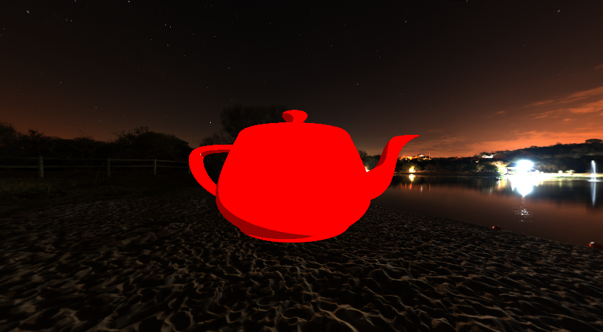
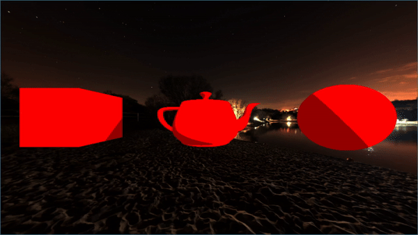

# 3-D Graphics Engine
A 3-D Graphics renderer written in C++ and using the Vulkan API.

This project is very much used as a learning experience and will grow as I continue to learn about Vulkan and 3-D
rendering in general.

## Features
- Math libriaries for matrices and vectors
- Vulkan backend (trying to use/learn every advantage Vulkan has to other APIs)
- Load OBJ models
- Basic Blinn shading
- Efficient environment map
- Free-cam with mouse controls
- Basic FPS counter
- Render multiple 3-D models with their own positions and orientation
- A work-in-progress scene description format to define the rendered world

## TODO
- A material system for rendering objects
- Text Rendering and custom UI library
- Basic physics engine
- Networking (for multi-player games)
- A lot more shaders than just the basic Blinn shading
- Documentation

## Building
I use the provided shell scripts (run.ps1 and run.sh) to build the project. 

*Need to run the scripts from the root of the project*

*Building on Windows is a work-in-progress, have experienced some bugs while on Windows*

### Dependencies
- Vulkan SDK
- glslc (might come packaged with the Vulkan SDK)
- cmake
- make
- Ninja (if building on Windows)
- A C++ compiler (this will be Visual Studio, if building on Windows)
- GLFW

## Controls
| Controls | Action | 
| -------- | ------ |
| Q | Quit the program |
| C | Toggle camera mode (freecam or lock to target) |
| R | Toggle rotation animation | 
| WASD | Move the camera | 
| Mouse | Look around |
